# Introduction
This is a demo repository in that:
- generation of a device output on a local computer is simulated by a script that generates random 32x32 px black-and-white images.
- a Python (PySpark) script that uses functionality of Spark Structured Streaming detects newly generated images and transfers these to an Azure Blob Storage.
- an Azure Function App monitors above Azure Blob Storage and upon arrival of new images calculates the total sum of pixel values in each image (think of this as a dummy surrogate for performing some form of prediction on these images) and then writes this value to an Azure SQL database .

# Set up environment
- Set up a Python environment with the packages specified in the file <code>requirements.txt</code>. I am running this example using Python 3.9.16. In order for PySpark to work properly, you might need to download the file <code>hadoop.dll</code> (available here: https://github.com/cdarlint/winutils/blob/master/hadoop-3.2.2/bin/hadoop.dll) and place it into your <code>C:\Windows\System32</code> folder. In order for PyODBC to work, you might also need to install the needed ODBC driver (see https://learn.microsoft.com/en-us/sql/connect/odbc/download-odbc-driver-for-sql-server?view=sql-server-ver16).

# Set up of Azure resources
- Blob storage:
    - First, we create a Azure Storage Account as shown in the screenshots below. Essentially, we just make the storage account non-public and leave everything else to Azure's default options:

    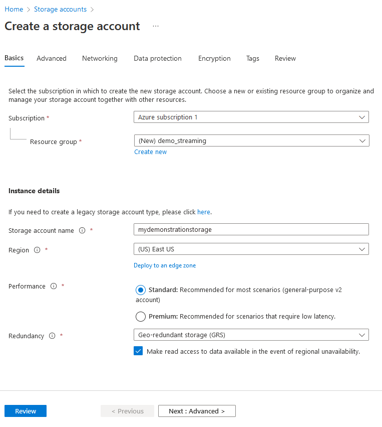  
    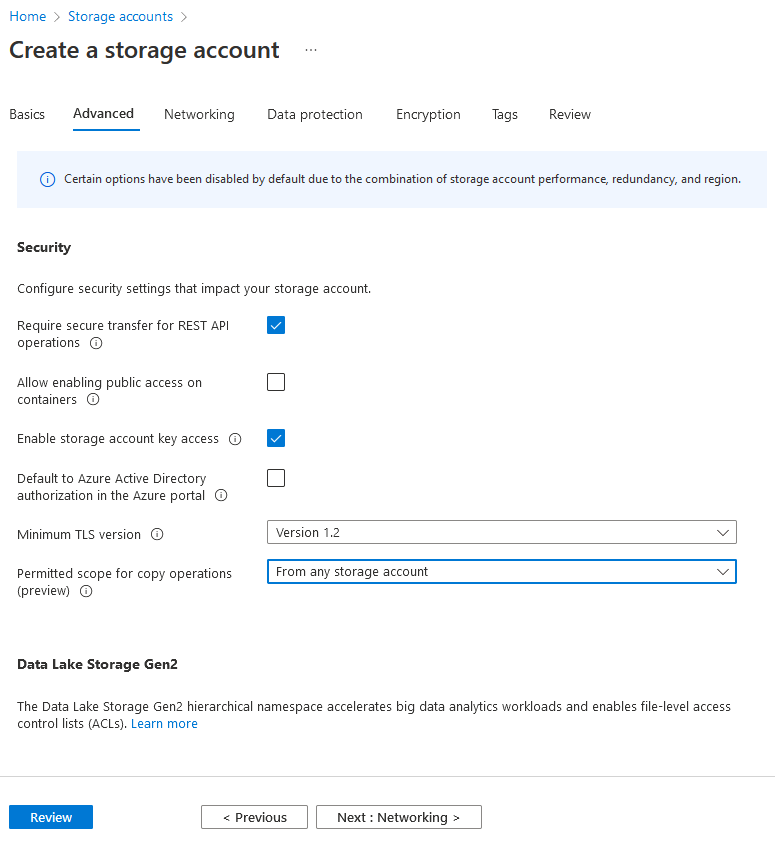

    - After creation of our storage account, we create a container called <code>img</code>.

    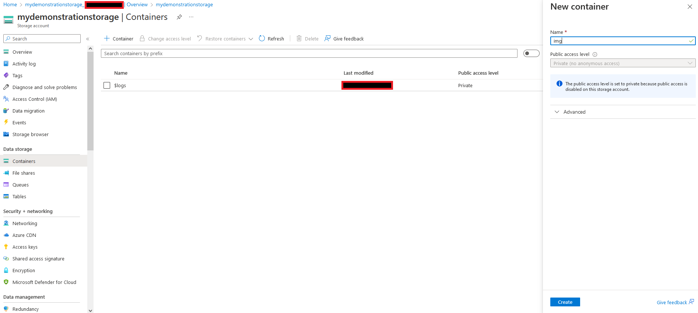

    - In our credentials folder, to the credentials.py file we add the variables: <code> storage_account_name = "mydemonstrationstorage" </code> and <code> storage_container_name = "img" </code>.

    - Furthermore, we will store our the access key of our storage account to a variable <code> storage_access_key </code>. See the image below to learn where you can find your access key. Note that it is bad practice to store secrets in code. Because this is just a quick demonstration, we will do so anyways.

    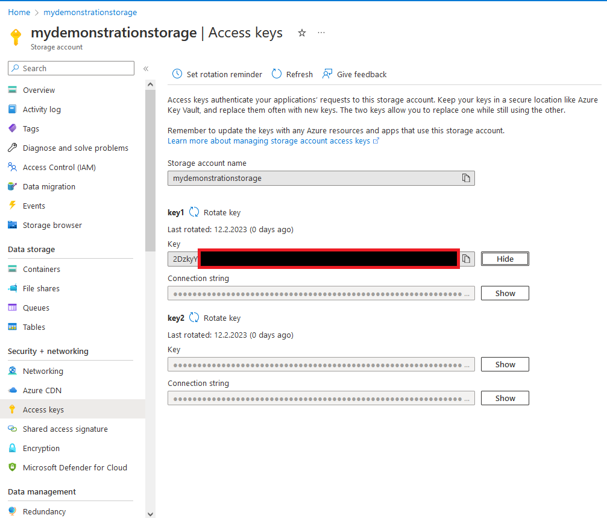

- SQL database
    - Create a SQL database as shown in the screenshots below. Make sure to change the expensive default database (under "Compute + storage" -> "Configure database") to a cheaper one. I use the basic option of the DTU-based pricing model here. Use SQL authentication as shown in the screenshot, set and remember your admin password. You will need it in the next step.

    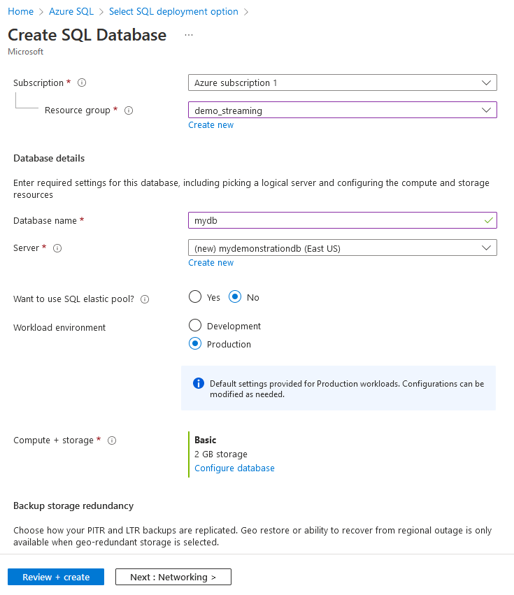  
    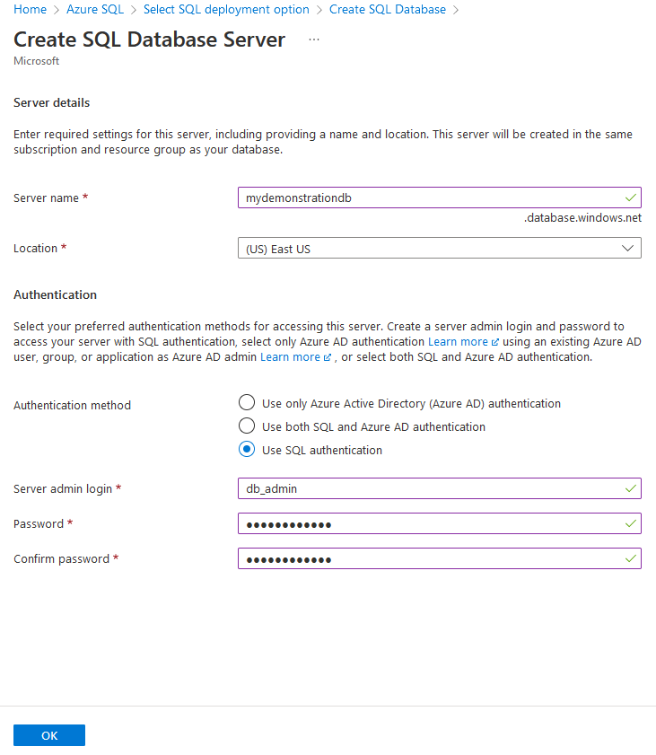

    - Find the ODBC connection string of your database (see below). Set it as variable <code>db_connection_str</code> in your <code>./credentials/credentials.py</code> file. Make sure to substitute the placeholder in the "Pwd={your_password_here}" part with the password you set in the step before.

    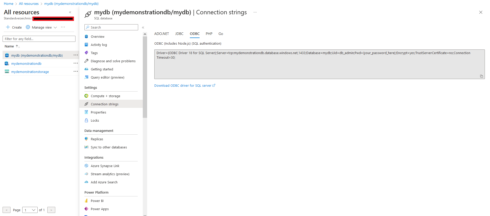

    - In the networking tab of your database resource, allow access from selected networks. Add your client IPv4 address to the firewall exceptions and check the "Allow Azure services and resources to access this server" option and save:
    
    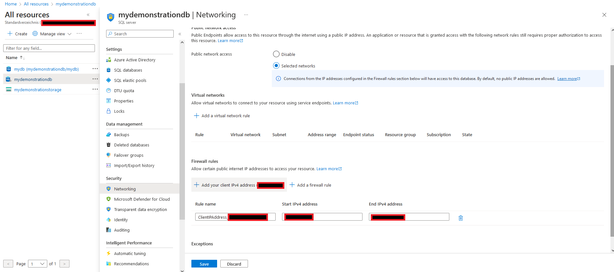

    - Initialize the database by running the <code>initialize_db.py</code> script.

- Azure Functions:
    - Create a Azure Functions resource as shown below. Selection Python 3.9 as runtime stack and make sure that in the hosting tab you select your storage account that you created before. Everything else is left to Azure's default settings.

    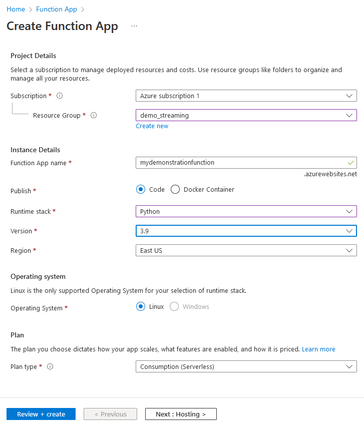  
    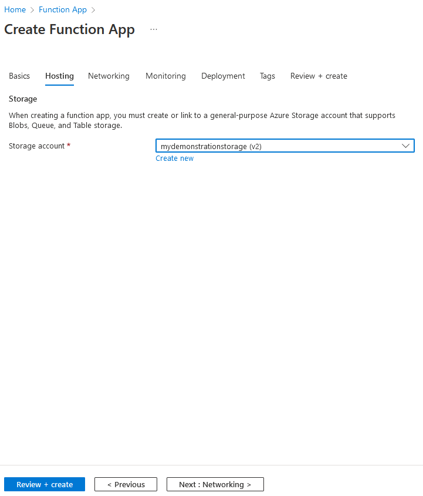

    - Now navigate to your <code>"./azure_function"</code> folder and create a zip archive name <code>BlobListener1.zip</code> that contains the folder <code>"./BlobListener1"</code>, the <code>host.json</code>, and the <code>requirements.txt</code> file.
    - Open a command prompt and navigate to your <code>"./azure_function"</code> folder. Make sure you have the Azure CLI installed (https://learn.microsoft.com/en-us/cli/azure/install-azure-cli). In the command prompt enter: <code>az functionapp deployment source config-zip -g demo_streaming -n mydemonstrationfunction --src BlobTrigger1.zip --build-remote true --verbose</code> ("demo_streaming" is your resource group,  "mydemonstrationfunction" is the name of your function app, and "BlobTrigger1.zip" is the zip archive you created in the previous step).
    - In your Azure Function app, go to "Setting - Configuration" and create a new application setting called <code>db_connection_str</code> that you set to the same value it has in your <code>./credentials/credentials.py</code> file. Make sure your database admin password is included in that string. Also make sure that in the <code>Driver={ODBC Driver 18 for SQL Server}</code> part of the string you substitute 18 for 17 because the base image used in Azure Function app comes with this driver:
    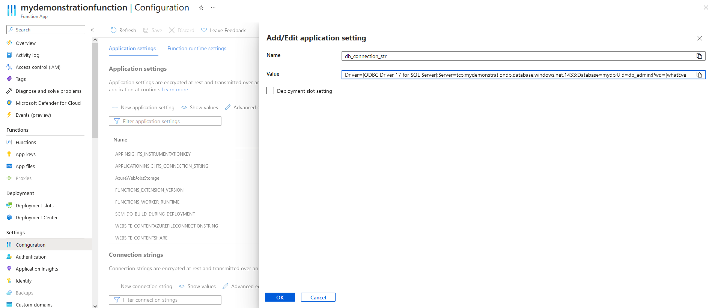

# Action
- Run your <code>stream_local_files_to_azure_blob_storage.py</code> script. You might also consider to schedule execution of this script automatically on start up using the Windows Task Scheduler. 
- Then, start your <code>generate_device_output.py</code> script.
- That's more or less it. Everything else you should know work as envisioned in the introduction. Query your database to see the final result.
